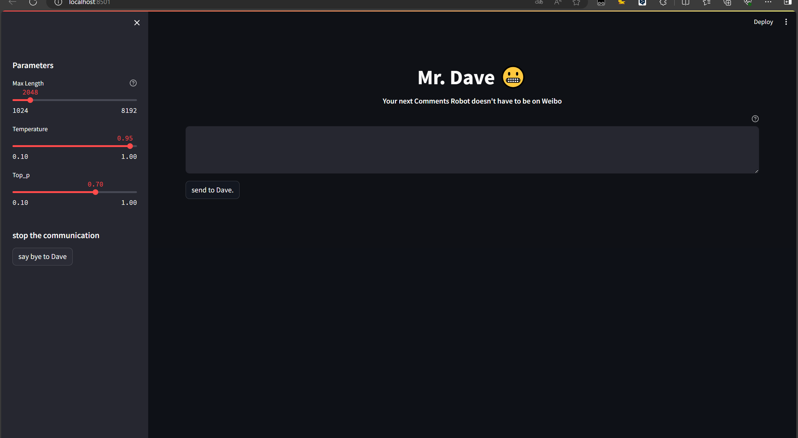
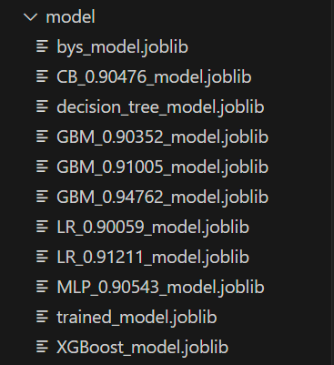
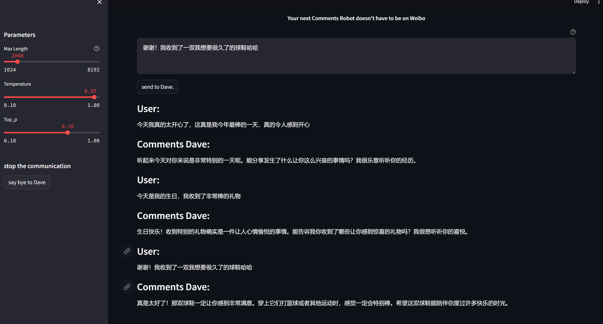

# Mr.Dave

*Read this in [English](README_en.md).*

## 介绍

你的下一个微博罗伯特何必是罗伯特

这是一个我在使用开源数据集([Twitter Emotion Dataset (kaggle.com)](https://www.kaggle.com/datasets/adhamelkomy/twitter-emotion-dataset/data))进行短文本情绪识别的多分类任务所衍生出来的拓展项目。当得到了可以输入新样本预测的模型文件后，我想到了我们或许可以使用模型文件来做一个类似与微博罗伯特的评论机器人。

后续考虑增加自动抓取社交媒体评论文本组件，自动回复抓取到的评论，达到个人账户“罗伯特”效果，并且拓充对话模型以及整个项目的稳定性及可实施性。

这是数据集处理及模型训练的kaggle笔记本链接 [Multi-classification emotion recognition task (kaggle.com)](https://www.kaggle.com/code/hengyulling/multi-classification-emotion-recognition-task)

在模型训练及评估过程中，使用 joblib 库的 dump() 保存了训练出来的最佳模型文件。

利用开源对话模型，通过预测出来的发言文本的情绪分类标签来引导对话模型对发言的内容进行评论回复。当文本表达正面情绪，例如开心、惊喜时，让对话模型给予必要的认可和赞美；在遇到负面情绪时，例如愤怒、惊恐、伤心，让对话模型适当的给予安慰、关心和开导。

对话模型我选用了近期开源的GLM4-9B([THUDM/GLM-4: GLM-4 series: Open Multilingual Multimodal Chat LMs | 开源多语言多模态对话模型 (github.com)](https://github.com/THUDM/GLM-4))，基于其优秀的中文底层训练数据，具有强大的自然语言处理能力。它可以在多种平台上运行，支持代码执行、联网浏览和画图等工具。。在硬件配置方面，GLM4-9B 需要较高的计算能力和存储空间，我在尝试本地部署运行爆显存后，最后使用了openai的api接口进行运用。

当然了，使用其他开源模型也是可以实现的，目前因为想实现中文的小应用，并且也有使用ChatGLM的经验，因此选择了它。

-----

## 使用方式

### 硬件需求
建议选择具备足够计算能力的设备

### 环境安装
请使用 pip 安装依赖：`pip install -r requirements.txt`

### 运行步骤
`streamlit run ui.py`

-----
## 运行展示
负面情绪演示：我不太聪明，无法真正感受到我的音乐，对小事没有热情，我不确定我是否会去做。

正面情绪演示：今天我真的太开心了，这真是我今年最棒的一天，真的令人感到开心。

-----
## TODO

看这个仓库是否让人感兴趣(star)

- 自动抓取指定文本组件
- 多种可替换的对话模型
- 定制数据集进行微调训练
- 更优的复杂神经网络模型算法
- 真正落地的个人社交媒体评论机器人

-----
## 协议
本仓库的代码依照 [Apache-2.0](LICENSE) 协议开源，

