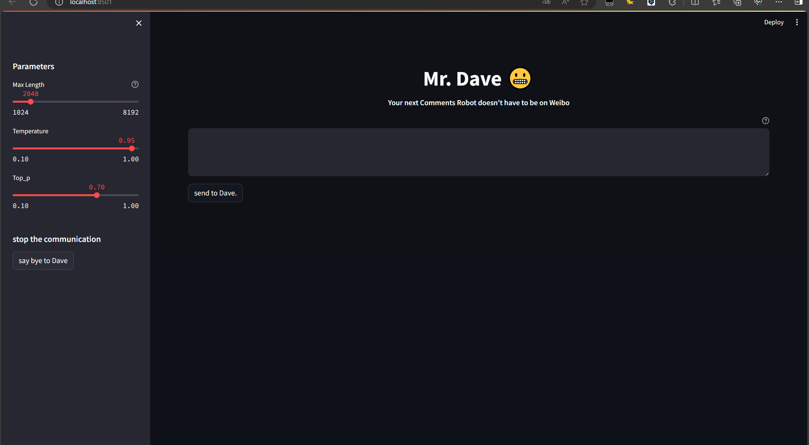
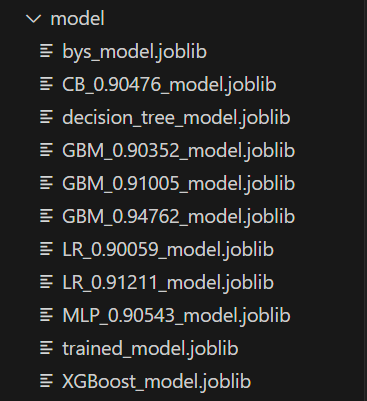
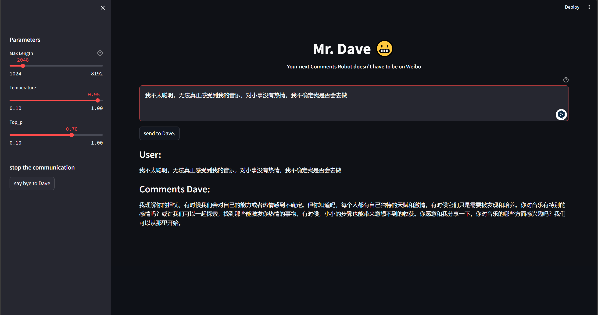
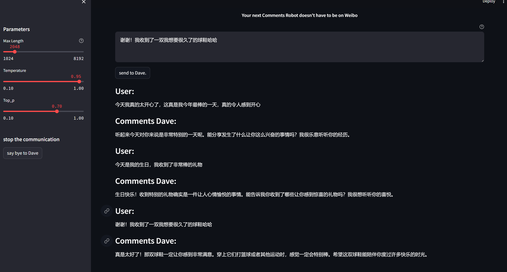

# Mr.Dave

*Read this in [中文](README.md).*
## introduce

Your next Comments Robot doesn't have to be on Weibo

This is an extension of my multi-classification task for short text sentiment recognition using an open-source dataset ([Twitter Emotion Dataset (kaggle.com)](https://www.kaggle.com/datasets/adhamelkomy/twitter-emotion-dataset/data))When I got a model file that I could use to feed in the predictions of the new samples, I thought that we might be able to use the model file to make a comment bot similar to Robert on Weibo.

In the future, we will consider adding an automatic text component for grabbing social media comments, automatically replying to the captured comments, achieving the "Robert" effect of personal accounts, and expanding the stability and implementability of the dialogue model and the entire project.

This is a link to the kaggle notebook for dataset processing and model training  [Multi-classification emotion recognition task (kaggle.com)](https://www.kaggle.com/code/hengyulling/multi-classification-emotion-recognition-task)

In the process of model training and evaluation, the best model files are saved by using dump() of the joblib library.

Using the open-source dialogue model, the sentiment classification label of the predicted speech text is used to guide the dialogue model to comment and reply to the content of the speech. When the text expresses positive emotions, such as happiness and surprise, let the dialogue model give the necessary recognition and praise; When encountering negative emotions, such as anger, panic, and sadness, let the conversation model appropriately provide comfort, care, and enlightenment.

I chose GLM4-9B, which was recently open sourced, for the dialogue model([THUDM/GLM-4: GLM-4 series: Open Multilingual Multimodal Chat LMs | 开源多语言多模态对话模型 (github.com)](https://github.com/THUDM/GLM-4))，Based on its excellent Chinese underlying training data, it has strong natural language processing capabilities. It runs on a variety of platforms and supports tools such as code execution, web browsing, and drawing. In terms of hardware configuration, GLM4-9B requires high computing power and storage space, and after trying to run the video memory locally, I finally used OpenAI's API interface to use it.

Of course, it is also possible to use other open source models, and I chose it because I wanted to implement a small application in Chinese and had experience in using ChatGLM.

## Mode of use

### Hardware requirement
It is recommended to choose a device with sufficient computing power

### Environmental installation
Use pip to install dependencies:`pip install -r requirements.txt`

https://www.bilibili.com/video/BV1iM4y1y7oA/?spm_id_from=333.788.0.0&vd_source=38a6ca096c69b42b176bdfa0ab4e928c)

### Run procedure
`streamlit run ui.py`

-----
## Running display
Negative Emotions Presentation: I'm not very smart to really feel my music, I'm not passionate about the little things, and I'm not sure if I'm going to do it.

Positive Emotions Presentation: I'm really happy today, it's really the best day of my year, it's really happy.

-----
- ## TODO

  See if this repository is interesting (star)

  - Automatically grabs the specified text component
  - Multiple interchangeable conversation models
  - Customize datasets for fine-tuning training
  - Better algorithms for complex neural network models
  - A personal social media comment bot that actually lands

-----
## agreement
The code of this warehouse is open source according to [Apache-2.0](LICENSE).

